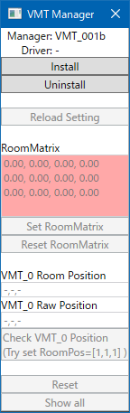
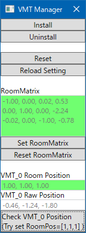

# VMT - VirtualMotionTracker 説明書

## ドライバのインストール
**1. VMTをダウンロードし、解凍します。**  
[ダウンロード](https://github.com/gpsnmeajp/VirtualMotionTracker/releases)  
次にインストールしますので、今後移動しない場所においてください。  
デスクトップなど一時的な場所には置かないでください。  

**2. vmt_manager.exeを起動します。**  
vmt_managerフォルダ内にあります。

**3. vmt_managerをファイアーウォールで許可します。**  
お使いの環境によりますが許可してください。  

**4. Installボタンを押してください**  
ドライバーのパスがVRシステムに登録されます。

**5. SteamVRを再起動してください。**  
vmt_managerが自動で終了します。

**6. SteamVRをファイアーウォールで許可します**

## ルームセットアップ
**1. vmt_managerを起動してください。**  

**2. VR機器やコントローラーを起動してください。**  
ルーム情報を認識します。Room Matrixが緑色になるまで待ってください。  
</img>
</img>  

**3. Set Room Matrixボタンを押してください**  
ルーム座標変換行列が登録され、setting.jsonに保存されます。

## 動作確認
**1. Check VMT_0 Positionボタンを押してください**  
**2. SteamVRにトラッカーが表示され、VMT_0 Room Positionが緑色になればOKです**  
赤色になる場合は、Room Matrixが設定されていないか、ルーム情報が前回設定されたものと変わっています。  
</img>  

