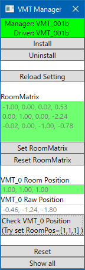
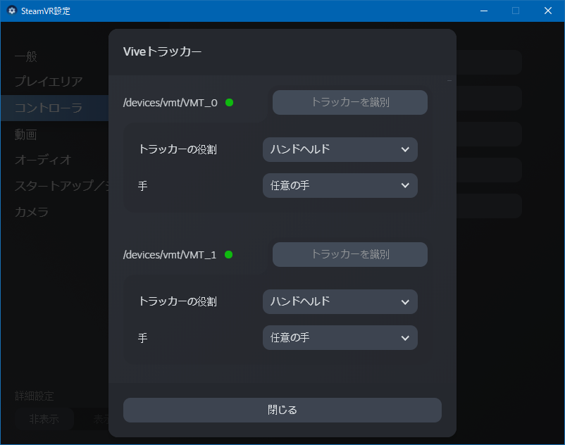
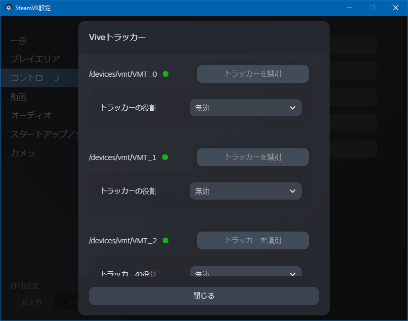

# VMT - VirtualMotionTracker 説明書
## 注意
アップデートの際は、古いドライバを予めアンインストールするか、フォルダごと消してください。  
古いドライバが読み込まれて動かないことがあります。  

## 仕組み
**VMT**  
C++製OpenVRドライバです。OSCでの仮想トラッカー姿勢の受信と、SteamVRへの姿勢の受け渡しを行います。  
座標変換はここでやっています。正常に動いていればSteamVRとともに起動し、終了します。  
SteamVRのWeb Consoleからエラーなどを確認することができます。  
設定はドライバフォルダのsetting.jsonに記録されます。  
  
なお、VR空間内での見た目はとりあえずベースステーションになっています。  
  
**VMT Manager**  
C#製管理ツールです。ドライバのインストールやアンインストール、設定や調整、動作確認の際に使用します。  
必要なときだけ起動してください。毎度起動する必要はありません。  
ルームセットアップをやり直したときは、このツールでの設定(Set RoomMatrix)もやり直してください。  
  
## ドライバのインストール
**1. VMTをダウンロードし、解凍します。**  
[ダウンロード](https://github.com/gpsnmeajp/VirtualMotionTracker/releases)  
次にインストールしますので、今後移動しない場所においてください。  
デスクトップなど一時的な場所には置かないでください。  

**2. vmt_manager.exeを起動します。**  
vmt_managerフォルダ内にあります。

**3. vmt_managerをファイアーウォールで許可します。**  
お使いの環境によりますが許可してください。  
</img>

**4. Installボタンを押してください**  
ドライバーのパスがVRシステムに登録されます。  
</img>
</img>

**5. SteamVRを再起動してください。**  
vmt_managerが自動で終了します。

**6. SteamVRをファイアーウォールで許可します**

## ルーム情報設定
**1. vmt_managerを起動してください。**  

**2. VR機器やコントローラーを起動してください。**  
ルーム情報を認識します。Room Matrixが緑色になるまで待ってください。  
</img>
</img>  

**3. Set Room Matrixボタンを押してください**  
ルーム座標変換行列が登録され、setting.jsonに保存されます。

## 動作確認
**1. Check VMT_0 Positionボタンを押してください**  
**2. SteamVRにトラッカーが表示され、VMT_0 Room Positionが緑色になればOKです**  
赤色になる場合は、Room Matrixが設定されていないか、ルーム情報が前回設定されたものと変わっています。  
</img>
</img>  

## ハンドヘルドの解除
VRゲームでコントローラ代わりに反応してしまう場合は、以下の設定をしてください。  
**1. 必要な数のトラッカーを出してください(必要であればManagerからShow allをクリックすると全部有効になります)**  
**2. SteamVRの設定→デバイス→Viveトラッカーを管理**  
</img>  
**3. Viveトラッカーの管理**  
</img>  
**4. トラッカーの役割を「無効」**  
これを必要な数だけ行います。  
</img>
</img>  

## OSCプロトコル

|方向|ポート番号|
|---|---|
|App → Driver| 39570|
|Manager → Driver| 39570|
|Manager ← Driver| 39571|

注意: 39571が使用されているとManagerは起動しません。  
  
### 仮想トラッカー制御
**仮想トラッカーの引数**  

|識別子|型|内容|
|---|---|---|
|index|int| 識別番号。現在0～57まで利用できます。|
|enable|int| 有効可否。1で有効、0で無効(非接続・非トラッキング状態)|
|timeoffset|float| 補正時間。通常0です。|
|x,y,z|float| 座標|
|qx,qy,qz,qw|float| 回転(クォータニオン)|

**/VMT/Room/Unity index,enable,timeoffset,x,y,z,qx,qy,qz,qw**  
Unityと同じ左手系、かつ、ルーム空間(ルーム空間変換あり)で仮想トラッカーを操作します。  
通常はこれを使用します。  
  
**/VMT/Room/Driver index,enable,timeoffset,x,y,z,qx,qy,qz,qw**   
OpenVRの右手系、かつ、ルーム空間(ルーム空間変換あり)で仮想トラッカーを操作します。  
  
**/VMT/Raw/Unity index,enable,timeoffset,x,y,z,qx,qy,qz,qw**  
Unityと同じ左手系、かつ、ドライバー空間(ルーム空間変換なし)で仮想トラッカーを操作します。  
  
**/VMT/Raw/Driver index,enable,timeoffset,x,y,z,qx,qy,qz,qw**  
OpenVRの右手系、かつ、ドライバー空間(ルーム空間変換なし)で仮想トラッカーを操作します。  
  
### ドライバ操作
**/VMT/Reset**  
すべてのトラッカーを非トラッキング状態にします。  
  
**/VMT/LoadSetting**  
ドライバーのjson設定を再読込します。  
  
**/VMT/SetRoomMatrix m1,m2,m3,m4,m5,m6,m7,m8,m9,m10,m11,m12**  
RoomToDriver空間変換行列を設定します。  
設定と同時にjsonに書き込むため、毎フレーム送るなど頻繁な送信は禁止します。  

### ドライバ側応答
**/VMT/Out/Log stat,msg**  
stat(int): 状態(0=info,1=warn,2=err)  
msg(string): メッセージ  
  
**/VMT/Out/Alive version**  
version(string): バージョン  
  

### Unityサンプル
[hecomi/uOSC](https://github.com/hecomi/uOSC)を導入してください。  
アタッチされたGameObjectの座標をトラッカーとして送信します。  
  
```cs
using System.Collections;
using System.Collections.Generic;
using UnityEngine;
public class sendme : MonoBehaviour
{
    uOSC.uOscClient client;
    void Start()
    {
        client = GetComponent<uOSC.uOscClient>();
    }

    void Update()
    {
        client.Send("/VMT/Room/Unity", (int)0, (int)1, (float)0f,
            (float)transform.position.x,
            (float)transform.position.y,
            (float)transform.position.z,
            (float)transform.rotation.x,
            (float)transform.rotation.y,
            (float)transform.rotation.z,
            (float)transform.rotation.w
        );
    }
}
```
## コマンドライン引数
|例|機能|
|---|---|
|vmt_manager.exe install|ドライバをインストールします|
|vmt_manager.exe uninstall|ドライバをアンインストールします|

## よくあるトラブル
**RoomMatrixが赤色のまま緑色にならない**  
→VR機器の電源が入っているか確認してください。  
VR機器がスリープになっていないか確認してください。  
ベースステーションの電源が入っているか確認してください。  
SteamVRのルームセットアップが完了しているか確認してください。  
SteamVRをインストールしているか確認してください。  
  
**Check VMT_0 Positionを押しても反応がない**  
→Installをしてください。SteamVRがセーフモードであれば解除してください。  
その後、忘れずにSteamVRを再起動してください。  
ファイアーウォールでSteamVR(vrserver.exe)を許可しているか確認してください。  
  
**Check VMT_0 Positionを押すとRoomPositionが赤色になる**  
→VR機器が接続され、RoomMatrixが緑色になった状態で、Set RoomMatrixをしてください。  
その上で再度Check VMT_0 Positionをクリックしてください。  
  
**VMC_0 Room PositionがUnityと符号が合わない**  
→Driver空間座標なので一部符号が逆転します。  

**前は動いてたのに、なんかずれるようになった**  
→ルームセットアップをやり直しませんでしたか？  
再度Set RoomMatrixをしてください。  
