## [ドライバのインストール](howto.md)
**1. VMTをダウンロードし、解凍します。**  
[ダウンロード](https://github.com/gpsnmeajp/VirtualMotionTracker/releases)  
次にインストールしますので、今後移動しない場所においてください。  
デスクトップなど一時的な場所には置かないでください。  

**2. vmt_manager.exeを起動します。**  
vmt_managerフォルダ内にあります。

**3. vmt_managerをファイアーウォールで許可します。**  
お使いの環境によりますが許可してください。  
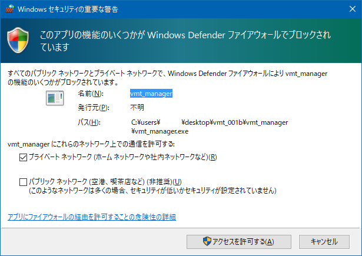</img>

**4. Installボタンを押してください**  
ドライバーのパスがVRシステムに登録されます。  
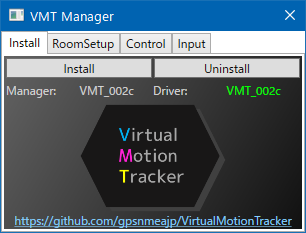</img>
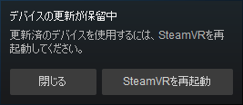</img>

**5. SteamVRを再起動してください。**  
vmt_managerが自動で終了します。

**6. SteamVRをファイアーウォールで許可します**

## ルーム情報設定
**1. vmt_managerを起動してください。**  

**2. VR機器やコントローラーを起動してください。**  
ルーム情報を認識します。Room Matrixが緑色になるまで待ってください。  
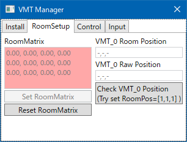</img>
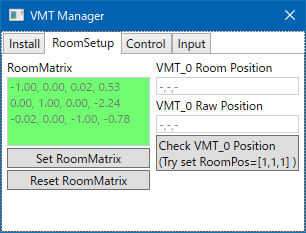</img>  

**3. Set Room Matrixボタンを押してください**  
ルーム座標変換行列が登録され、setting.jsonに保存されます。

## 動作確認
**1. Check VMT_0 Positionボタンを押してください**  
**2. SteamVRにトラッカーが表示され、VMT_0 Room Positionが緑色になればOKです**  
赤色になる場合は、Room Matrixが設定されていないか、ルーム情報が前回設定されたものと変わっています。  
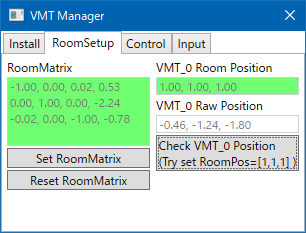</img>
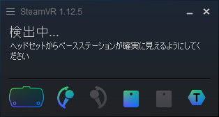</img>  

## コントローラ入力の確認
入力の動作確認ができます。  
下記のようにSteamVRにてトラッカーに役割を設定していない場合、動作しません。  
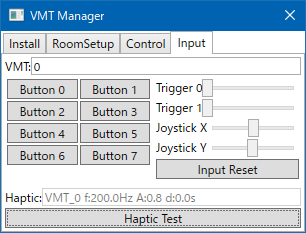</img>  

## ハンドヘルドの設定
VRゲームでコントローラ代わりに使いたい場合、解除したい場合は、以下の設定をしてください。  
**1. 必要な数のトラッカーを出してください**  
(必要であればManagerからShow allをクリックすると全部有効になります)  
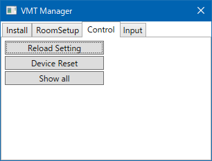</img>  
  
**2. SteamVRの設定→デバイス→Viveトラッカーを管理**  
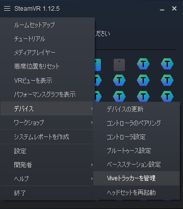</img>  
  
**3. Viveトラッカーの管理**  
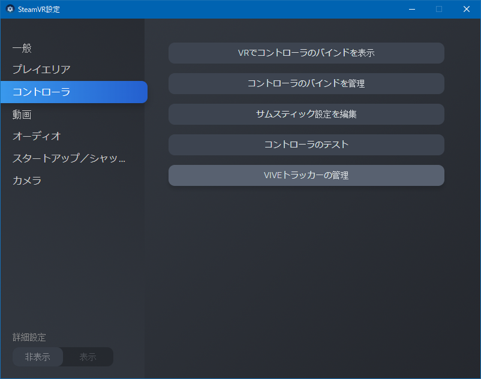</img>  
  
**4. トラッカーの役割を設定**  
これを必要な数だけ行います。  
</img>
</img>  

## よくあるトラブル
**RoomMatrixが赤色のまま緑色にならない**  
→VR機器の電源が入っているか確認してください。  
VR機器がスリープになっていないか確認してください。  
ベースステーションの電源が入っているか確認してください。  
SteamVRのルームセットアップが完了しているか確認してください。  
SteamVRをインストールしているか確認してください。  
  
**Check VMT_0 Positionを押しても反応がない**  
→Installをしてください。SteamVRがセーフモードであれば解除してください。  
その後、忘れずにSteamVRを再起動してください。  
ファイアーウォールでSteamVR(vrserver.exe)を許可しているか確認してください。  
  
**Check VMT_0 Positionを押すとRoomPositionが赤色になる**  
→VR機器が接続され、RoomMatrixが緑色になった状態で、Set RoomMatrixをしてください。  
その上で再度Check VMT_0 Positionをクリックしてください。  
  
**VMC_0 Room PositionがUnityと符号が合わない**  
→Driver空間座標なので一部符号が逆転します。  

**前は動いてたのに、なんかずれるようになった**  
→ルームセットアップをやり直しませんでしたか？  
再度Set RoomMatrixをしてください。  

**UnityでHMDやコントローラの位置を取得したい**  
[EasyOpenVRUtil](https://github.com/gpsnmeajp/EasyOpenVRUtil)を使用してください。  
